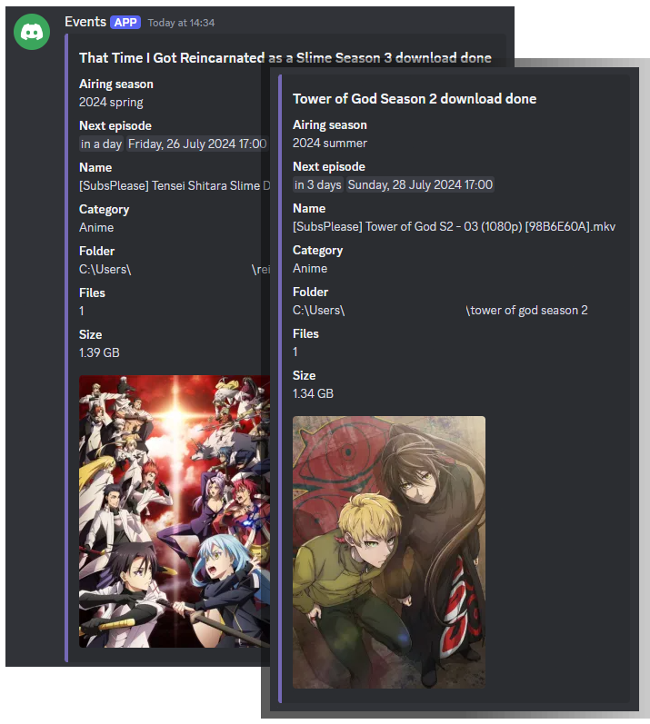

# Event-bot

A Discord bot created to send notifications when certain activities finish. The application will parse the command line
arguments, format the message and send it to the desired channel. Then the bot will be offline again.


## Current support

### Torrents

Triggered when QBitTorrent finishes a download. It has general support for any torrent.



#### Setup

Add the following to the QBitTorrent settings under `Tools>Options...>Downloads>Run on torrent finished:`

```bat
.\path\to\run.bat torrent --name "%N" --category "%L" --tags "%G" --content-path "%F"
--root-path "%R" --save-path "%D" --files "%C" --byte-size "%Z" --tracker "%T"
```

All arguments will be displayed as they are, but providing the following will have other effects:

| argument | effect                       |
|----------|------------------------------|
| category | sets the embed message color |

#### Custom support

| category | features |
|----------|----------|
| anime    | `save-path` gets the anime cover image, next airing episode date, complete name and season[\*](#save-path)       |

## Setup

To use, ensure the following environment variables are set, or in a `.env` file in the same directory as the current
working directory.

```ini
token=... # required
torrents_channel=... # optional, must be provided if torrents feature is used
```

For the token, go to https://discord.com/developers/applications, select your bot, choose "Bot" from the left, get the
token. For channel IDs, enable developer mode in Discord, right click the channel and select get ID.

## Caveats

### Save path

The save path must contain a name searchable on [Anilist](https://anilist.co/home). Use spaces or dashes in the name.
